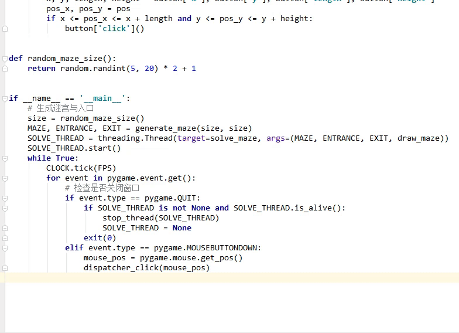

# 迷宫游戏

> `prime算法生成迷宫` `递归解迷宫` `pygame`

## 运行截图


## prime算法生成迷宫

参考了[Python 四大迷宫生成算法实现(2): 随机Prim算法](https://blog.csdn.net/marble_xu/article/details/88285926)这篇博客，实现还是挺简单的，博客里做了详细介绍

## 递归算法解迷宫

> 背景如下:

**迷宫以二维数组表示，其中0为路，1为墙，玩家只能在路上行走，不能穿越墙。**

由于逻辑比较简单，就直接自己实现了，主要思路如下：

**1. 玩家初始位置定位在迷宫入口**
```python
if __name__ == '__main__':
    # 生成迷宫与入口
    size = random_maze_size()
    MAZE, ENTRANCE, EXIT = generate_maze(size, size)
    SOLVE_THREAD = threading.Thread(target=solve_maze, args=(MAZE, ENTRANCE, EXIT, draw_maze))
    SOLVE_THREAD.start()
```
**2. 获取玩家上下左右四个相邻位置的值和位置**
```python
# 单元格类型
# 0 - 路，1 - 墙，2-走过的路，4-死胡同，不在迷宫里或是已经走过又回退回来，说明此路不通
class CellType:
    ROAD = 0
    WALL = 1
    WALKED = 2
    DEAD = 3
    
def valid(maze, x, y):
    if x < 0 or y < 0:
        return False
    if x >= len(maze) or y >= len(maze):
        return False
    val = maze[y][x]
    if val == CellType.WALL or val == CellType.DEAD:
        return False
    return val, x, y


def neighbors(maze, pos):
    x, y = pos
    t, r, d, l = valid(maze, x, y - 1), valid(maze, x + 1, y), valid(maze, x, y + 1), valid(maze, x - 1, y)
    return t, r, d, l
```
**3. 对获取到的相邻四个位置进行处理，返回最推荐走的位置与值**
```python
# 单元格类型
# 0 - 路，1 - 墙，2-走过的路，4-死胡同，不在迷宫里或是已经走过又回退回来，说明此路不通
class CellType:
    ROAD = 0
    WALL = 1
    WALKED = 2
    DEAD = 3
    
def suggest_pos(cells):
    arr = []
    # 遍历相邻4个位置
    for cell in cells:
        # 如果不是False，说明是路，可能是没走过的路，也可能是走过的路，添加到数组中
        if cell:
            arr.append(cell[0])
        # 如果是False，说明是墙或者死胡同，不再考虑
        else:
            arr.append(CellType.DEAD)
    # 优先推荐没走过的路，根据我们CellType中的定义，没走过的路值最小，其次是走过的路
    return cells[arr.index(min(arr))]
```
**4. 对推荐的位置进行处理**
- 如果是没走过的路，直接**走**，并把当前的位置标记为已走过
- 如果是走过的路，也**走**，并把当前的位置标记为死胡同，此路不通
- 如果没有推荐的路，游戏结束，迷宫有问题，无解
- **走** 这个动作，就用到了递归，继续调用`solve_maze`方法，位置参数改为推荐的下一步的位置
- 重复以上步骤直到当前位置与出口位置重叠，迷宫走完，游戏结束
```python
    next_pos = suggest_pos((t, r, d, l))
    if next_pos:
        if next_pos[0] == CellType.WALKED:
            mark_dead(maze, pos)
        else:
            mark_walked(maze, pos)
        return solve_maze(maze, (next_pos[1], next_pos[2]), end)
    else:
        mark_dead(maze, pos)
        return False
```
## pygame做界面展示
简单的实现，没啥可说的